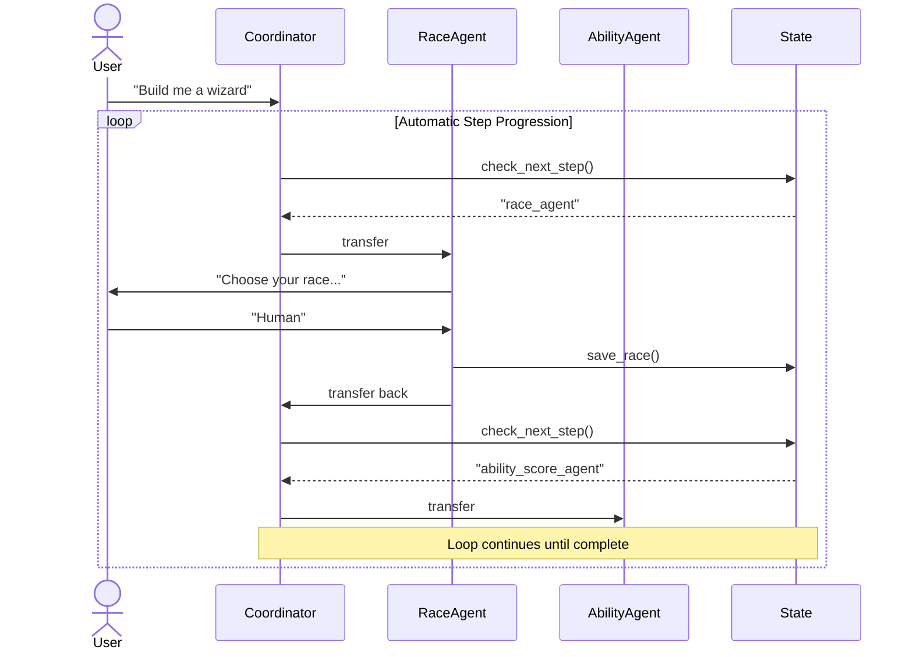

# Wizard-Wizard

An AI agent that guides you through building a Level 1 D&D 5e Wizard character, step by step.

This repo demonstrates the **Wizard Pattern** - an AI design pattern for multi-step configuration workflows where agents automatically guide users through complex forms without requiring "continue" prompts between steps.

## How It Works



The coordinator automatically moves you through 10 steps:
1. **Race** → 2. **Ability Scores** → 3. **Class** → 4. **Background** → 5. **Spellcasting** → 6. **Spellbook** → 7. **Cantrips** → 8. **Prepared Spells** → 9. **Derived Stats** → 10. **Validation**

## Quick Start

```bash
# Install dependencies
uv sync

# Run the wizard
uv run adk run wizard_agent

# Quick test with replay
uv run adk run wizard_agent --replay <(echo '{"state": {}, "queries": ["Build a wizard", "Gandalf", "Human"]}')
```

## The Pattern

This implementation showcases the **Automatic Looping Coordinator** pattern where:
- A coordinator agent continuously checks what step is needed next
- Specialized sub-agents handle each step independently
- Shared state is updated via tools and persists across transitions
- The flow is automatic - no "do you want to continue?" prompts

**Full pattern documentation:** [WIZARD_PATTERN.md](WIZARD_PATTERN.md)

This pattern is framework-agnostic and useful for any multi-step configuration workflow: onboarding flows, complex forms, approval processes, guided data entry, etc.

## Project Structure

```
wizard_agent/
├── agent.py              # Root coordinator
├── agents/               # Step-specific sub-agents
├── tools/                # Domain tools + state management
├── models/               # Pydantic state models
└── data/                 # D&D 5e reference data

tests/                    # pytest tests
```

## Development

```
uv sync
uv run pytest .
uv run ruff check .
uv run ruff format .
uv run ty .
uv run adk run wizard_agent
uv run adk web
```