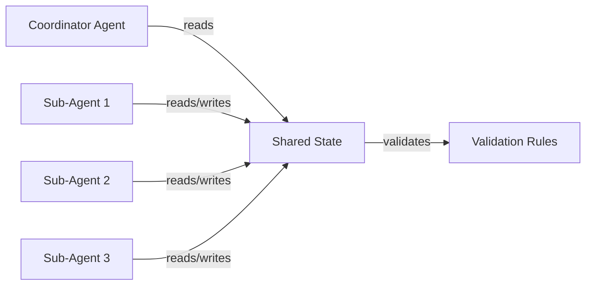
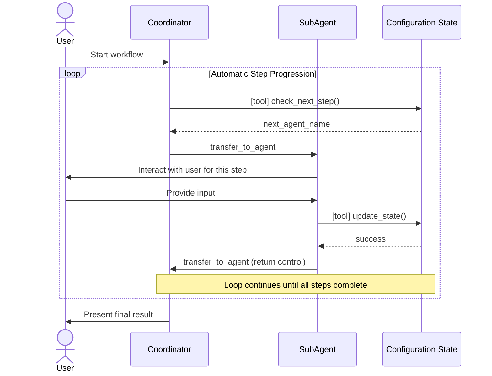
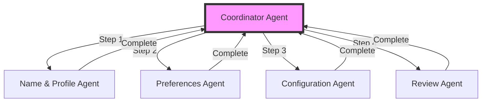
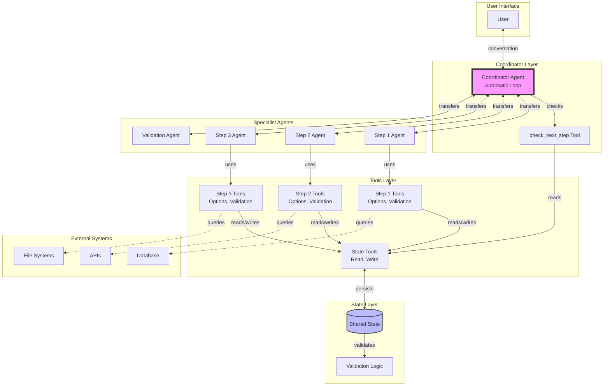

# The Wizard Pattern

An architectural pattern for building AI-driven multi-step forms and configuration wizards.

## Overview

The Wizard Pattern enables AI agents to guide users through complex, multi-step workflows where:
- Each step requires user input and decision-making
- Steps depend on previous choices
- The process must feel natural and conversational
- State builds progressively toward a complete, validated result

This pattern is particularly useful for enterprise workflows like:
- Complex configuration forms
- Onboarding processes
- Application wizards
- Multi-step approvals
- Guided data entry

## Core Concepts

### 1. Shared State with Validation

All agents read from and write to a **shared state object** that represents the work in progress.

**Key principles:**
- State is the single source of truth
- Tools provide controlled read/write access
- **Validation happens at multiple levels:**
  - Input validation: Check user input before saving
  - State validation: Verify state consistency on updates
  - Cross-step validation: Ensure compatibility between steps
  - Final validation: Confirm complete configuration is valid
- State persists across agent transitions



**Example state structure with validation:**
```python
from pydantic import BaseModel

class WizardState(BaseModel):
    # Progress tracking
    completed_steps: list[str] = []

    # Domain data
    user_selections: dict = {}
    configuration: dict = {}

    # Validation methods
    def is_step_complete(self, step_name: str) -> bool:
        """Check if step has all required data"""
        required_fields = STEP_REQUIREMENTS[step_name]
        return all(self.configuration.get(field) for field in required_fields)

    def validate_field(self, field: str, value: Any) -> list[str]:
        """Validate a single field value"""
        errors = []
        validator = FIELD_VALIDATORS.get(field)
        if validator and not validator(value):
            errors.append(f"Invalid value for {field}")
        return errors

    def validate_complete(self) -> tuple[bool, list[str]]:
        """Validate entire configuration is complete and consistent"""
        errors = []

        # Check all steps complete
        for step in REQUIRED_STEPS:
            if not self.is_step_complete(step):
                errors.append(f"Step '{step}' is incomplete")

        # Check cross-field consistency
        errors.extend(self._validate_consistency())

        return (len(errors) == 0, errors)
```

### 2. Automatic Looping Coordinator

The coordinator agent operates in a **continuous loop**, automatically progressing through steps without requiring explicit "continue" commands from users.

**The loop:**
1. Check what step is needed next
2. Transfer control to the appropriate specialist agent
3. When specialist returns, repeat from step 1

**Key implementation detail:** Sub-agents must explicitly transfer control back to the coordinator to trigger the next loop iteration.



### 3. Specialized Sub-Agents

Each step has a **dedicated specialist agent** focused solely on that step's concerns.

**Benefits:**
- Clear separation of concerns
- Simpler prompts (each agent has one job)
- Easier to test and debug individual steps
- Can be developed independently

**Agent responsibilities:**
- Present options to the user
- Validate user choices for this step only
- Update shared state via tools
- Transfer back to coordinator when complete



### 4. Step-Specific Tools

Each step has **specialized tools** for retrieving options and validating choices.

**Types of tools:**

**a) Option Retrieval Tools**
- Query external data sources
- Filter based on previous choices
- Present contextual recommendations

```python
def list_available_options(
    category: str,
    filters: dict,
    tool_context: ToolContext
) -> list[Option]:
    """Get filtered options based on current state"""
    state = get_state(tool_context)
    # Apply filters based on previous selections
    return filtered_options
```

**b) Validation Tools**
- Check if choice is valid
- Verify compatibility with previous selections
- Return structured error messages

```python
def validate_selection(
    selection: str,
    tool_context: ToolContext
) -> ValidationResult:
    """Validate selection against current state"""
    state = get_state(tool_context)
    # Check compatibility, requirements, etc.
    return ValidationResult(valid=True, errors=[])
```

**c) State Mutation Tools**
- Save step data
- Update shared state atomically
- Trigger side effects if needed

```python
def save_step_data(
    step_name: str,
    data: dict,
    tool_context: ToolContext
) -> Result:
    """Save step data to shared state"""
    state = get_state(tool_context)
    state.completed_steps.append(step_name)
    state.update(data)
    save_state(tool_context, state)
    return Result(status="success")
```

### 5. Progress Determination Tool

A **central tool** that encodes the workflow logic and determines what step comes next.

```python
def check_next_step(tool_context: ToolContext) -> NextStep:
    """Determine what step should be executed next"""
    state = get_state(tool_context)

    # Check each step in order
    if not state.is_step_complete("profile"):
        return NextStep(
            agent="profile_agent",
            step_name="Profile Setup",
            reason="User profile is incomplete"
        )

    if not state.is_step_complete("preferences"):
        return NextStep(
            agent="preferences_agent",
            step_name="Preferences",
            reason="User preferences not set"
        )

    # ... check remaining steps

    return NextStep(
        agent="complete",
        step_name="Complete",
        reason="All steps finished"
    )
```

**Benefits of centralized step logic:**
- Single place to modify workflow order
- Easy to add conditional branches
- Simple to implement "skip" logic
- Clear audit trail of why each step was chosen

## Complete Architecture



## Implementation Guidelines

### Coordinator Agent Prompt Pattern

```
You are a Coordinator Agent managing a multi-step workflow.

Your job is to operate in a LOOP:
1. Check what step is needed next
2. Transfer to the appropriate specialist agent
3. When control returns, go back to step 1

EVERY time you are invoked:
1. Call check_next_step to see what needs to be done
2. Add a brief transition comment (optional)
3. IMMEDIATELY transfer to the agent indicated
4. NEVER ask "do you want to continue?"

Example:
User: "I want to configure the system"
You: [call check_next_step] → "Let's start! First, we'll set up your profile." [transfer to profile_agent]

[profile_agent completes and returns]
You: [call check_next_step] → "Great! Now let's configure your preferences." [transfer to preferences_agent]

... continues automatically until complete
```

### Sub-Agent Prompt Pattern

```
You are the [STEP NAME] specialist agent.

Your job is to:
1. Present options using [list_options] tool
2. Help user make their selection
3. Validate their choice using [validate_choice] tool
4. Save their selection using [save_selection] tool
5. Transfer back to coordinator using transfer_to_agent

CRITICAL: After completing your work, you MUST explicitly transfer back to the coordinator agent. Do NOT just stop responding.

Example completion:
1. Use save_selection to save data
2. Confirm in ONE brief sentence
3. Use transfer_to_agent("coordinator") to continue the flow
```

### State Design Considerations

**What to include:**
- Domain data being collected
- Progress tracking (completed steps)
- Metadata (timestamps, user info)
- Computed/derived fields

**What to avoid:**
- Conversational history (framework handles this)
- Temporary UI state
- Agent internal state

**Validation patterns:**
```python
class WizardState(BaseModel):
    # Data
    selections: dict = {}

    # Validation methods
    def validate_compatibility(self) -> list[str]:
        """Check if selections are compatible"""
        errors = []
        # Domain-specific validation
        return errors

    def is_complete(self) -> bool:
        """Check if all required steps are done"""
        required = ["step1", "step2", "step3"]
        return all(self.selections.get(s) for s in required)
```

## Common Patterns and Variations

### Conditional Branches

```python
def check_next_step(state):
    if not state.profile_complete:
        return "profile_agent"

    # Branch based on user type
    if state.user_type == "advanced":
        return "advanced_config_agent"
    else:
        return "simple_config_agent"

    # Continue with common steps
    if not state.review_complete:
        return "review_agent"

    return "complete"
```

### Skippable Steps

```python
def check_next_step(state):
    if not state.required_step_complete:
        return "required_agent"

    # Optional step - only if user hasn't explicitly skipped
    if not state.optional_complete and not state.optional_skipped:
        return "optional_agent"

    return next_step
```

### Review and Edit

```python
def check_next_step(state):
    # Normal forward flow
    if state.mode == "forward":
        return get_next_incomplete_step(state)

    # Review mode - show summary and allow edits
    if state.mode == "review":
        return "review_agent"

    # Edit mode - jump to specific step
    if state.mode == "edit" and state.edit_target:
        return f"{state.edit_target}_agent"
```

### Parallel Data Collection

For independent steps that can be done in any order:

```python
def check_next_step(state):
    # Get all incomplete independent steps
    incomplete = [
        s for s in ["personal", "professional", "preferences"]
        if not state.is_complete(s)
    ]

    if incomplete:
        # Return first incomplete (or let user choose)
        return f"{incomplete[0]}_agent"

    # Once all independent steps done, move to dependent steps
    return "integration_agent"
```

## Testing Strategies

### 1. Unit Test State Tools

```python
def test_save_selection():
    context = create_test_context()
    result = save_selection("step1", {"choice": "A"}, context)

    assert result.status == "success"
    state = get_state(context)
    assert state.selections["step1"] == {"choice": "A"}
```

### 2. Test Progress Logic

```python
def test_check_next_step_sequence():
    context = create_test_context()

    # Initially should go to first step
    next_step = check_next_step(context)
    assert next_step.agent == "step1_agent"

    # After completing step 1, should go to step 2
    save_selection("step1", {...}, context)
    next_step = check_next_step(context)
    assert next_step.agent == "step2_agent"
```

### 3. Replay Testing

Use replay files to test full workflows:

```json
{
  "state": {},
  "queries": [
    "Start configuration",
    "Profile: John Doe",
    "Preferences: Dark mode",
    "Configuration: Advanced"
  ]
}
```

Run with: `adk run coordinator --replay test.json`

### 4. Integration Testing

Test that agents properly transfer control:

```python
def test_agent_transfers():
    # Start workflow
    response = coordinator.process("Start")
    assert "transfer_to_agent" in response.actions
    assert response.actions.transfer_to_agent == "step1_agent"

    # Complete step 1
    response = step1_agent.process("My choice")
    assert response.actions.transfer_to_agent == "coordinator"
```

## Benefits of This Pattern

1. **Natural Conversation Flow**: Users interact naturally at each step without having to navigate menus or forms

2. **Separation of Concerns**: Each agent has a single, clear responsibility

3. **Maintainable**: Easy to add, remove, or reorder steps by modifying `check_next_step`

4. **Testable**: Each component can be tested independently

5. **Resumable**: State persistence allows users to pause and resume

6. **Auditable**: Clear record of decisions and why each step was triggered

7. **Flexible**: Supports conditional branches, skips, and parallel paths

8. **Type-Safe**: Structured state with validation prevents invalid configurations

## Example: Simplified Implementation

Here's a minimal implementation sketch:

```python
# State
class WizardState(BaseModel):
    step1_data: dict | None = None
    step2_data: dict | None = None
    step3_data: dict | None = None

# Tools
def check_next_step(context):
    state = get_state(context)
    if not state.step1_data:
        return {"agent": "step1_agent"}
    if not state.step2_data:
        return {"agent": "step2_agent"}
    if not state.step3_data:
        return {"agent": "step3_agent"}
    return {"agent": "complete"}

# Coordinator
coordinator = Agent(
    name="coordinator",
    instruction="""
    LOOP: call check_next_step, then transfer to indicated agent.
    NEVER ask if user wants to continue.
    """,
    tools=[check_next_step],
    sub_agents=[step1_agent, step2_agent, step3_agent]
)

# Sub-agent
step1_agent = Agent(
    name="step1_agent",
    instruction="""
    1. Collect step 1 data from user
    2. Save using save_step1_data tool
    3. Transfer back to coordinator
    """,
    tools=[save_step1_data]
)
```